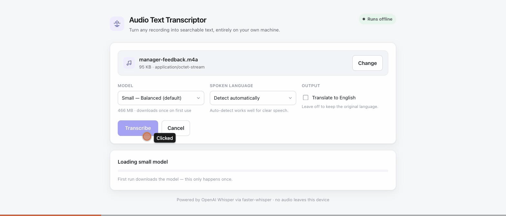
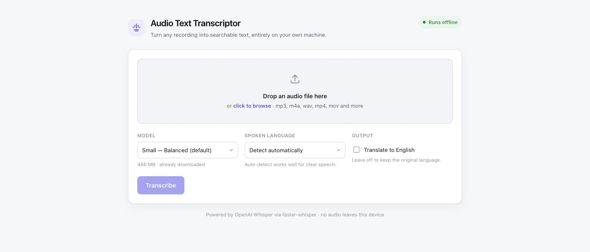
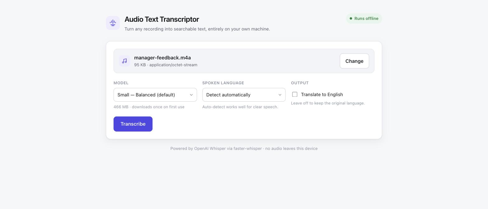
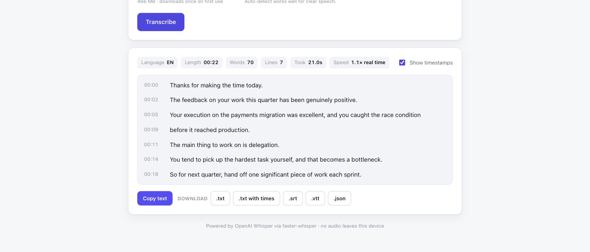

# Audio Text Transcriptor — showcase

Turn any recording into searchable text, entirely on your own machine.

A local-first transcription app: drop in an audio or video file and get a
timestamped transcript you can read, copy or export as `.txt`, `.srt`, `.vtt` or
`.json`. Speech recognition runs on your own CPU through OpenAI's Whisper
models — no cloud service, no API key, and no audio ever leaves the device.

> This repository is a showcase. It documents what the app does and how it is
> put together; the implementation lives in a private repository.



---

## Why I built it

Transcribing a recording usually means uploading it to somebody else's server.
That is a poor trade for anything sensitive — a performance review, a doctor's
appointment, a call with a client. Whisper is good enough to run locally now, so
the upload is no longer a necessary cost. This app makes the local path the easy
one: one command to start, drag a file in, read the transcript.

## What it does

- **Drag and drop** any audio or video file — mp3, m4a, wav, aac, flac, ogg,
  opus, aiff, and the audio track of mp4, mov, mkv and webm.
- **Live transcript.** Lines appear as they are decoded rather than all at the
  end, so you can start reading a long recording immediately.
- **Five Whisper models**, from `tiny` (8× real time) to `large-v3` (best
  accuracy), chosen per job.
- **99 languages**, auto-detected, with optional translation into English.
- **Timestamped output**, toggleable between timestamped lines and plain prose.
- **Five export formats** — plain text, timestamped text, SRT and VTT subtitles,
  and JSON with per-segment timings.
- **Silence-aware.** Voice-activity detection skips quiet stretches, which
  speeds up decoding and stops Whisper inventing text where nobody is speaking.
- **Genuinely offline.** After the one-time model download, the app makes no
  outbound network requests at all.

## Screenshots

| Drop a file | Pick model and language |
|---|---|
|  |  |

**Transcript, with stats and export buttons**



The stats row reports what actually happened: detected language, recording
length, word and line counts, wall-clock time, and throughput relative to real
time.

## How it works

```
Browser (drag & drop)
      │  POST /api/transcribe          multipart upload, streamed to disk
      ▼
FastAPI                                validates, creates a job, returns 202
      │
      ▼
Worker thread                          faster-whisper: VAD → decode → segments
      │
      │  GET /api/jobs/{id}/stream     server-sent events, one per new segment
      ▼
Browser renders each line as it arrives
      │
      │  GET /api/jobs/{id}/download/{fmt}
      ▼
txt · timestamped txt · srt · vtt · json
```

Transcription is CPU-bound and blocking, so each job runs on its own worker
thread while the web layer reads job state under a lock. The browser follows
progress over server-sent events instead of polling — that is what makes lines
appear mid-transcription.

There is a longer write-up of the design decisions in
[docs/architecture.md](docs/architecture.md).

## Stack

| Layer | Choice | Why |
|---|---|---|
| Speech recognition | [faster-whisper](https://github.com/SYSTRAN/faster-whisper) (CTranslate2) | 4× faster than reference Whisper on CPU and needs no PyTorch — the whole environment is 194 MB instead of ~5 GB |
| Audio decoding | PyAV | Bundles its own ffmpeg, so there is no system dependency to install |
| Server | FastAPI + Uvicorn | Async streaming responses for SSE, with typed request validation |
| Frontend | Vanilla HTML/CSS/JS | No build step and no framework — the UI is three static files |
| Environment | uv + standalone CPython 3.12 | Self-contained, reproducible, installs nothing globally |

## Performance

Measured on an Apple M-series CPU with int8 quantisation. "2.5× real time"
means a 10-minute recording finishes in about 4 minutes.

| Model | Size | Throughput |
|---|---|---|
| `tiny` | 75 MB | ~8× real time |
| `base` | 142 MB | ~2.5× real time |
| `small` | 466 MB | ~1.1× real time |
| `medium` | 1.5 GB | ~0.4× real time |
| `large-v3` | 2.9 GB | ~0.2× real time |

The demo above uses `small`: 22 seconds of speech transcribed in 21 seconds,
word-for-word correct.

## Design notes

A few decisions worth calling out:

**Streaming beats waiting.** The first version returned the whole transcript in
one response. On a 40-minute recording that is a blank screen for 20 minutes.
Publishing each segment as it is decoded turned the same wait into something you
can read as it fills in.

**Isolation was a requirement, not a nicety.** The app keeps its own Python
interpreter, its own model cache and its own port, and installs nothing
globally. Deleting the folder removes it completely — which also means it can
never break a neighbouring project.

**int8 over float32.** Quantised inference is roughly 3–4× faster on CPU with no
accuracy difference that matters for speech. It is the reason `small` runs
faster than real time on a laptop.

**Voice-activity detection earns its keep twice.** It cuts decoding time by
skipping silence, and it suppresses Whisper's habit of hallucinating text into
quiet passages.

## A note on the demo

The recording in the GIF and screenshots is synthetic — a scripted example of
performance-review feedback, rendered with macOS text-to-speech. No real
person's audio appears anywhere in this repository.

## Licence

The application is MIT licensed. This showcase repository contains
documentation and media only.

Speech recognition by [faster-whisper](https://github.com/SYSTRAN/faster-whisper),
a CTranslate2 reimplementation of [OpenAI Whisper](https://github.com/openai/whisper).
